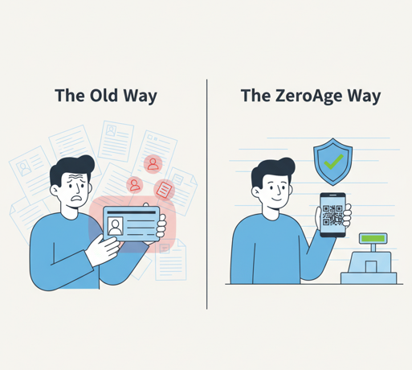
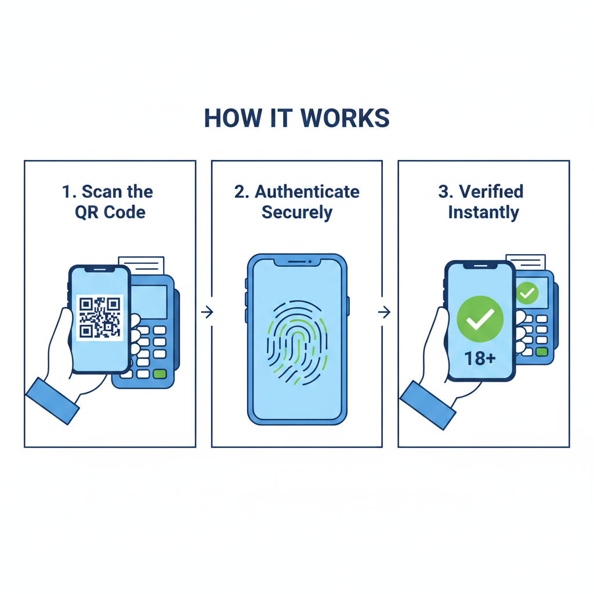
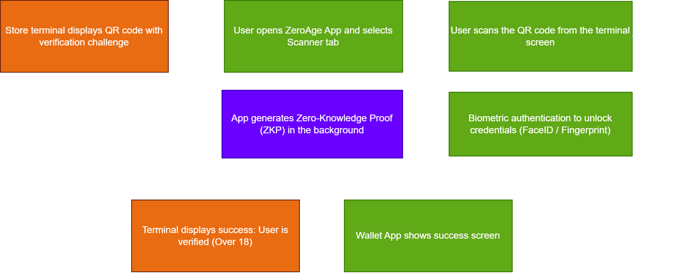

# EUDI Wallet & eIDAS 2.0 - Business Context and User Stories

## 1. Introduction: What is the European Digital Identity (EUDI) Wallet?

The **eIDAS 2.0** regulation is a new European Union legal framework that introduces the concept of the European Digital Identity Wallet (EUDI Wallet). It is envisioned as a free, highly secure mobile application available to every EU citizen, designed to store digital identity documents (such as national IDs, driving licenses, and university diplomas) and share them safely across all Member States. The fundamental goal of the EUDI Wallet is to give citizens full control over their personal data.

**The Goal of the ZeroAge Project:**
Our application, **ZeroAge**, serves as a functional Proof of Concept (PoC) of the EUDI Wallet ecosystem. While the EU is still testing large-scale solutions, our project focuses on implementing one specific, highly demanded use case: **secure age verification**. By acting as a mini-EUDI Wallet, ZeroAge demonstrates how users can prove they are over 18 years old without revealing any other sensitive personal information.

## 2. The Main Problem We Solve (Why Are We Doing This?)

**The Current Situation (The Problem):**
Currently, to buy age-restricted goods (like alcohol) in a physical store or to access 18+ online content, users are forced to show their entire ID card or even provide a digital scan of it. Consequently, the verifier (a cashier or a website administrator) gains access to a vast amount of sensitive personal data: the exact date of birth, PESEL (national identification number), address, and parents' names. This creates a massive privacy risk, exposes users to identity theft, and fundamentally violates the GDPR (RODO) principle of data minimization.

**Our Solution (The ZeroAge System):**
Our system completely reverses this dynamic. By utilizing Zero-Knowledge Proofs (ZKP) within our mobile wallet, users can prove the *fact* that they are over 18 years old without sharing any underlying data. The verifier only receives a cryptographic "YES" or "NO" confirmation. This protects user privacy while allowing businesses to fully comply with age-restriction laws.

## 3. Key Concepts (Explained Simply)

Our project implements the foundational principles of the eIDAS 2.0 framework:

*   **Selective Disclosure:** This is the most crucial innovation of the EUDI Wallet. It means that the user has full control and shares *only* the data that is absolutely necessary for a given transaction. In the ZeroAge system, instead of sharing an exact "Date of Birth," the wallet selectively discloses only a boolean attribute: `age > 18` (and optionally student status).
*   **Anti-tracking & Privacy by Design:** Verifiers (shops or websites) do not receive any unique, permanent identifiers. Thanks to the use of temporary, one-time QR codes and cryptographic tokens, it is impossible for businesses to track the user's activity, link different transactions together, or build behavioral profiles.

## 4. User Stories (Core Use Cases)

To demonstrate the practical application of the ZeroAge system within the EUDI framework, we have defined the following core User Stories from the perspective of the main actors in the ecosystem:

**A. The User (e.g., Citizen / Student)**
*   **As a user**, I want to securely store an age credential in my mobile wallet, **so that** I do not have to carry my physical ID card with me to prove my age.
*   **As a user**, I want to scan a store terminal's QR code to provide a zero-knowledge proof that I am over 18, **so that** I can protect my exact date of birth, name, and address from being exposed to strangers in a store or to online platforms.

**B. The Offline Verifier (e.g., Shop Cashier / Bouncer)**
*   **As a retail worker**, I want to quickly display a challenge QR code on my terminal for the customer to scan and see a simple "OK/FAIL" (or "18+") visual confirmation, **so that** I can efficiently and legally sell age-restricted goods (like alcohol or energy drinks) without having to manually calculate the customer's age from their date of birth.

**C. The Online Verifier (e.g., VOD Platform / Online Gambling)**
*   **As an online service provider**, I want to verify a user's age anonymously via a cryptographic zero-knowledge proof, **so that** I can strictly comply with legal age-restriction mandates without bearing the security risks and GDPR compliance costs of storing sensitive ID scans or documents on my servers.

**D. The Issuer (e.g., University / Government Agency)**
*   **As a trusted Issuer**, I want to securely issue digitally signed age credentials to eligible individuals, **so that** they can utilize these credentials seamlessly across the wider EUDI ecosystem.

## 5. Business Benefits (Value Proposition for Verifiers)

Why would businesses and online platforms want to integrate with the ZeroAge ecosystem?

*   **Massive Reduction in GDPR & Data Breach Risks:** Storing physical ID scans or exact birth dates creates a massive liability for companies in case of a hacker attack. By using our Zero-Knowledge approach, platforms only store a cryptographic proof of age. If their servers are breached, hackers get nothing of value (no names, no document numbers).
*   **Operational Efficiency (Faster Checkout):** In physical stores, checking IDs manually is slow and prone to human error (cashiers miscalculating the age from the birth year). Scanning the terminal's QR code by the customer takes less than a second and gives a definitive, legally binding result.
*   **Fraud Prevention:** Cryptographically signed credentials stored in a secure hardware enclave (Wallet) are virtually impossible to forge, unlike physical ID cards which can be faked by minors.

## 6. Real-World Demand & Legal Deadlines

The ZeroAge project aligns perfectly with the current priorities of the European Commission. The demand for such a system is driven by two main factors:

*   **Legal Mandates & Deadlines:** Under the eIDAS 2.0 and the Digital Services Act (DSA), Member States must provide EUDI Wallets to citizens by 2026. Shortly after (by 2027), Very Large Online Platforms (VLOPs) and sectors requiring Strong Customer Authentication (SCA) will be **legally required** to accept these wallets.
*   **UX & Conversion Rates:** For businesses, allowing users to verify their age or identity with a single click drastically improves the User Experience. It reduces friction during registration, leading to higher conversion rates while ensuring 100% legal compliance.

While Large Scale Pilots (like the POTENTIAL consortium) are currently testing identity fundamentals (like e-signatures and mobile driving licenses), the European Commission explicitly highlights **Electronic Age Verification** as a critical necessity for protecting minors online and accessing age-gated services.

## 7. References

*   **EUDI Wallet Architecture and Reference Framework (ARF):** https://github.com/eu-digital-identity-wallet/eudi-doc-architecture-and-reference-framework
*   **POTENTIAL Consortium:** Official EU Large Scale Pilot (https://www.digital-identity-wallet.eu/).
*   **NOBID Consortium:** Nordic-Baltic eID Project (https://www.nobidconsortium.com/).
*   **Bank Gospodarstwa Krajowego (BGK) Report:** EUDI Wallet and its business impact in the EU (https://www.bgk.pl/dla-klienta/strefa-wiedzy-bgk/artykul/eidas-20-czym-jest-europejski-portfel-tozsamosci-cyfrowej-i-jak-zmieni-biznes-w-ue/).
*   **ZIG Knowledge Base:** What Digital Identity means for enterprises (https://www.zig.pl/baza-wiedzy/eudi-wallet-i-cyfrowa-tozsamosc-co-oznacza-dla-przedsiebiorcow).